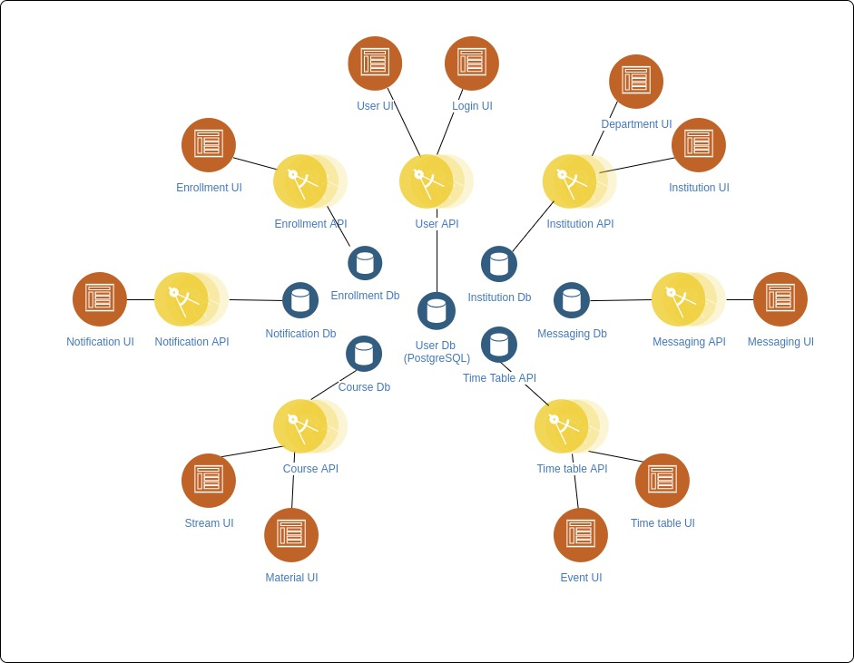
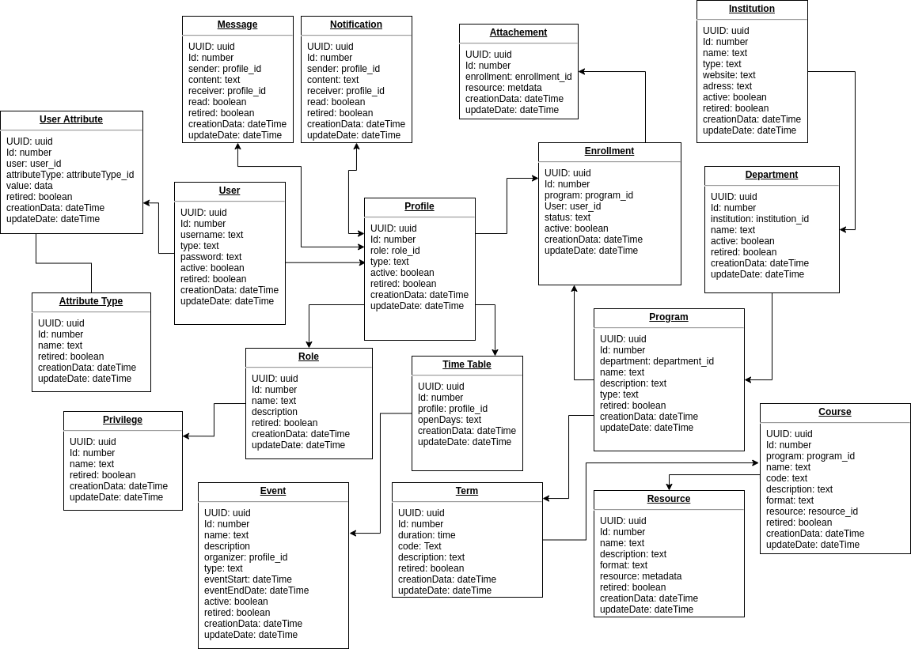

## What is OpenEMP

OpenEMP is techincally a microservices web system serve to provide a set of tools and logical apps, so all together manage the education workflow.

OpenEMP is separated into components (service) that are completely isolated, services are meant to be highly configurable and independently deployable.

We so far have 4 types of services:

- **API Service**: a REST API web application that use JSON as a representation format
- **data Service**: responsible on storing data for an API service, this could be a SQL , NoSQL database, or a filesystem volume... 
- **UI Service**: is a frontend web application that fetch resources from API service and display a UI web component
- **System Service**: is a service that play a role in the orchestration between services, doesn't take part of the education model but ensure the data management across services

!!! note
    data service should only communicate with one API service (it's a OneToOne relationship)

## Services Design

The following sketch is a demonstration of OpenEMP microservices:

For more details about OpenEMP services, please check the services documentation [here](../services/index.md)

## System Services

While there is services that altogether define how OpenEMP is working, there's other services that support the system architecture.

### Configurator

This is an API Service that read the "config folder" and provide it to all other services, an OpenEMP service should store the configuration files in the config folder to be included in the distrubtion definition

### Initializer

The initialzer is an API Service that initiate all services with metadata, therefore services shouldn't keep their data within their defition (code source)

## Data Levels

Data in OpenEMP are handled in 3 levels:

#### Config

The data that define how services should behave, this allows to enable options or define strectures, it could be in a format of Environment variables, properties or JSON files...

#### Metadata

these are data that should be filled in the system in order to be able to store information (eg: department names, possible user attributes ...) this should be prvided as data to be imported in a format of CSV, XML...

#### Data

This is all data stored in services and entered to the system by users. the data here are stored in databases.

## Data model

here is the initial core data model for OpenEMP

!!! note
    OpenEMP Initial Data model is set for demonstration and most relationships will be break down because of the microservices architecture.
